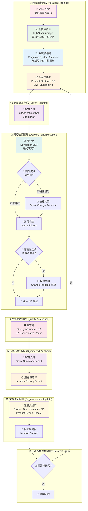
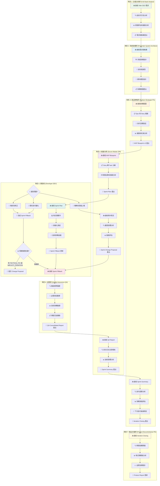
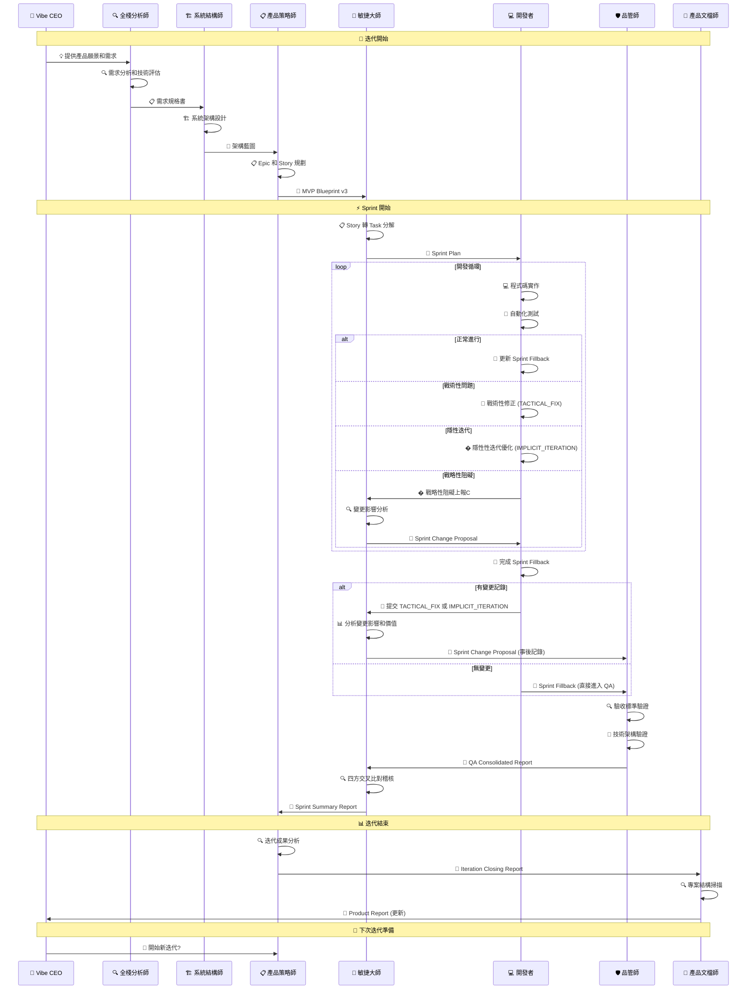
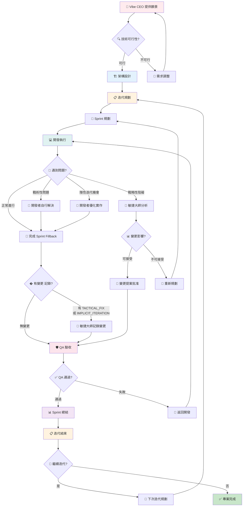
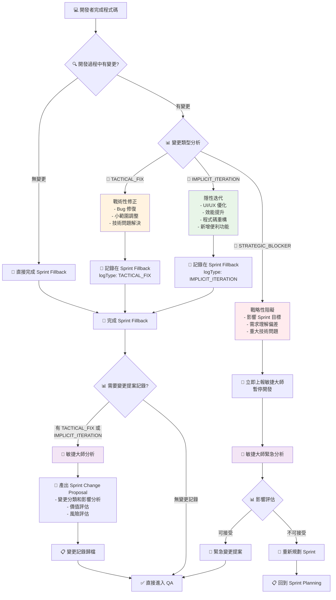
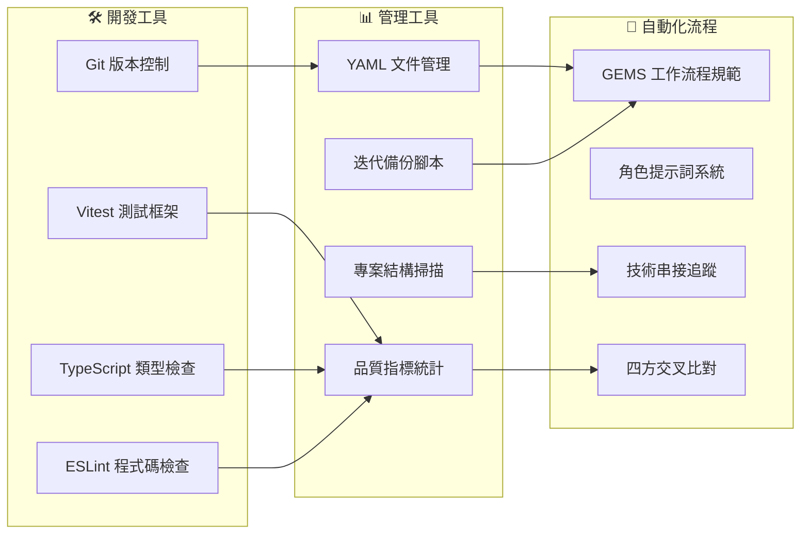

# GEMS 完整工作流程圖 (Complete Workflow)

## 🌟 GEMS 全角色運行流程總覽



## 🎭 GEMS 7 大角色詳細流程



## 🔄 GEMS 工作流程時序圖



## 📋 GEMS 角色職責矩陣

| 階段 | 主要角色 | 輸入文件 | 核心任務 | 輸出文件 | 協作角色 |
|------|----------|----------|----------|----------|----------|
| **需求分析** | 🔍 全棧分析師 | Vibe CEO 需求 | 技術可行性分析 | 需求規格書 | 👤 Vibe CEO |
| **架構設計** | 🏗️ 系統結構師 | 需求規格書 | 系統架構設計 | 架構藍圖 | 🔍 全棧分析師 |
| **迭代規劃** | 📋 產品策略師 | 架構藍圖 | Epic/Story 規劃 | MVP Blueprint v3 | 🏗️ 系統結構師 |
| **Sprint 規劃** | 🎯 敏捷大師 | MVP Blueprint v3 | Task 分解和估算 | Sprint Plan | 📋 產品策略師 |
| **開發執行** | 💻 開發者 | Sprint Plan | 程式碼實作和測試 | Sprint Fillback | 🎯 敏捷大師 |
| **變更記錄** | 🎯 敏捷大師 | Sprint Fillback | 隱性迭代和戰術修正分析 | Sprint Change Proposal | 💻 開發者 |
| **例外處理** | 🎯 敏捷大師 | 戰略性阻礙上報 | 緊急變更影響分析 | Sprint Change Proposal | 💻 開發者 |
| **品質驗收** | 🛡️ 品管師 | Sprint Fillback | 驗收和技術驗證 | QA Consolidated Report | 💻 開發者 |
| **Sprint 總結** | 🎯 敏捷大師 | QA Report | 四方交叉比對 | Sprint Summary Report | 🛡️ 品管師 |
| **迭代結束** | 📋 產品策略師 | Sprint Summary | 成果分析和規劃 | Iteration Closing Report | 🎯 敏捷大師 |
| **文檔更新** | 📝 產品文檔師 | Iteration Closing | 專案文檔維護 | Product Report | 📋 產品策略師 |

## 🎯 GEMS 決策流程圖



## � 隱E性迭代和變更管理流程



## 🔧 GEMS 工具和自動化



---

## 🎯 GEMS 工作流程特色

### ✨ 核心優勢
1. **🔄 完整閉環**：從需求到交付的完整追蹤
2. **🎭 角色分工**：7 個專業角色各司其職
3. **🔍 品質保證**：多層次的驗證和稽核機制
4. **📊 數據驅動**：基於實際執行數據的決策
5. **🚀 持續改進**：每次迭代都有學習和優化
6. **💡 變更管理**：完善的隱性迭代和戰術修正追蹤機制

### 🎯 適用場景
- 中小型軟體專案開發
- 敏捷開發團隊管理
- 技術債務控制
- 品質驅動的開發流程
- 迭代式產品開發

### 🚀 隱性迭代管理特色

**GEMS 獨特的三層變更管理機制**：

1. **🔧 TACTICAL_FIX** - 戰術性修正
   - 開發過程中的 Bug 修復和小範圍調整
   - 開發者權限內可自行處理
   - 需在 Sprint Fillback 中記錄

2. **🚀 IMPLICIT_ITERATION** - 隱性迭代
   - 超越原始需求的價值創造（如 UI 優化、效能提升）
   - 體現開發者的主動性和用戶導向思維
   - 需在 Sprint Fillback 中記錄並產生 Change Proposal

3. **🚨 STRATEGIC_BLOCKER** - 戰略性阻礙
   - 影響 Sprint 目標的重大問題
   - 需立即上報並暫停開發
   - 由敏捷大師進行影響分析和決策

**變更記錄流程**：
```
Sprint Fillback 完成 → 檢查變更記錄 → 產生 Change Proposal → 進入 QA 階段
```

**🌟 GEMS = 高效能 × 高品質 × 高可追溯性 × 完善變更管理的完美結合！**