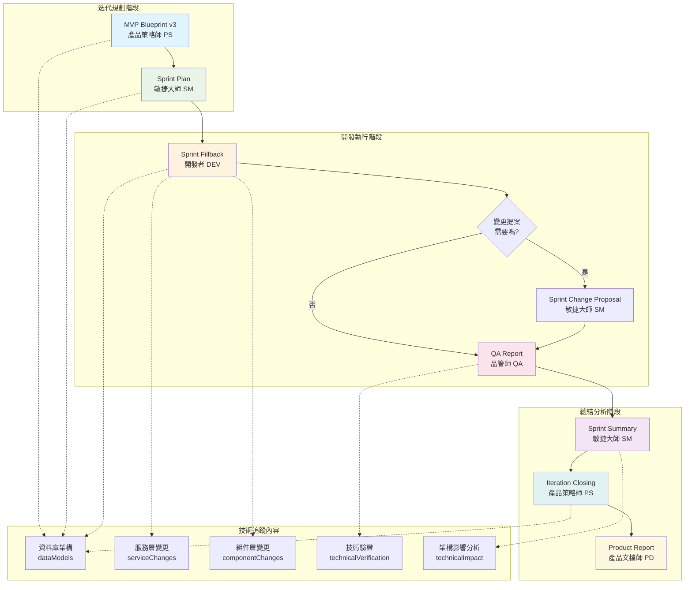
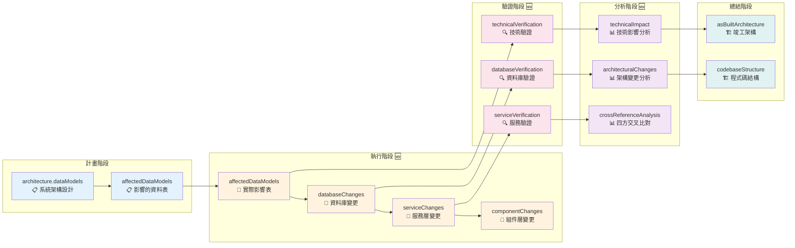
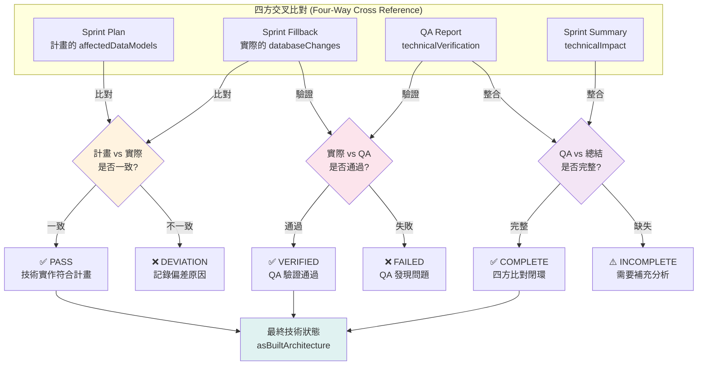
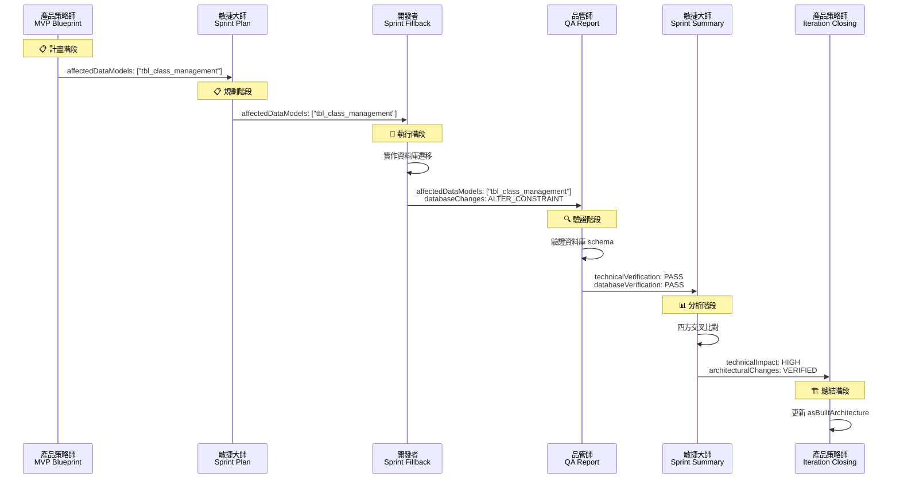

# GEMS 技術串接流程圖

## 🔄 完整技術串接流程



## 📊 技術資料流向圖



## 🔍 四方交叉比對流程



## 📋 各階段技術追蹤對比表

| 階段 | 原有內容 | 🆕 新增內容 | 目的 |
|------|----------|-------------|------|
| **MVP Blueprint** | ✅ architecture.dataModels<br/>✅ affectedDataModels | - | 系統架構設計 |
| **Sprint Plan** | ✅ affectedDataModels | - | 計畫階段追蹤 |
| **Sprint Fillback** | ❌ 只有 changedFiles | 🆕 affectedDataModels<br/>🆕 databaseChanges<br/>🆕 serviceChanges<br/>🆕 componentChanges | 實際執行追蹤 |
| **QA Report** | ❌ 無技術驗證 | 🆕 technicalVerification<br/>🆕 databaseVerification<br/>🆕 serviceVerification | 技術實作驗證 |
| **Sprint Summary** | ❌ 無架構分析 | 🆕 technicalImpact<br/>🆕 architecturalChanges<br/>🆕 crossReferenceAnalysis | 技術影響分析 |
| **Iteration Closing** | ✅ asBuiltArchitecture | - | 竣工架構總結 |

## 🎯 技術串接範例：STORY-1.1



## 💡 關鍵改進點

### 🔴 改進前的問題
```
MVP Blueprint → Sprint Plan → ❌ 斷層 ❌ → Iteration Closing
```

### 🟢 改進後的完整串接
```
MVP Blueprint → Sprint Plan → Sprint Fillback → QA Report → Sprint Summary → Iteration Closing
     ✅            ✅            🆕             🆕           🆕              ✅
```

### 🎯 解決的核心問題
1. **資料庫變更追蹤**：從計畫到實作到驗證的完整鏈路
2. **技術驗證機制**：QA 可以驗證技術實作是否符合計畫
3. **四方交叉比對**：確保計畫→執行→驗證→總結完全閉環
4. **架構演進記錄**：清楚追蹤系統架構的演進過程

---

**🚀 現在 DATABASE 和程式的依賴關係在整個 GEMS 工作流程中都能被有效追蹤和驗證了！**